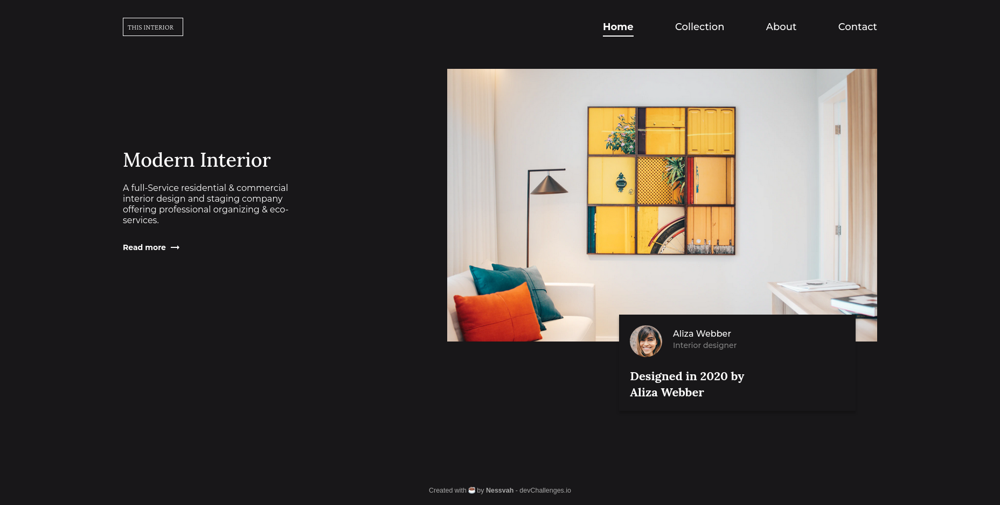

<!-- Please update value in the {}  -->

<h1 align="center">{Your project name}</h1>

   Solution for a challenge from  <a href="http://devchallenges.io" target="_blank">Devchallenges.io</a>.

  <h3>
    <a href="https://{your-demo-link.your-domain}">
      Demo
    </a>
     | 
    <a href="https://{your-url-to-the-solution}">
      Solution
    </a>
     | 
    <a href="https://devchallenges.io/challenges/Jymh2b2FyebRTUljkNcb">
      Challenge
    </a>
  </h3>

# Interior Consultant

My solution for a challenge from [Devchallenges.io](http://devchallenges.io)

### Demo

[Click Here](https://nessvah-interior-consultant.netlify.app)

### Solution

[Click Here](https://github.com/Nessvah/Interior-consultant)

### Challenge

[Click Here](https://devchallenges.io/challenges/Jymh2b2FyebRTUljkNcb)

## Table of Contents

- [Interior Consultant](#interior-consultant)
    - [Demo](#demo)
    - [Solution](#solution)
    - [Challenge](#challenge)
  - [Table of Contents](#table-of-contents)
  - [Overview](#overview)
    - [Built With](#built-with)
  - [Features](#features)
  - [Contact](#contact)

<!-- OVERVIEW -->

## Overview

Build the page with a mobile-first approach, always thinking about responsiveness and using semantic HTML
Used flexbox and position absolute to place the card which was quite easy
Tried to add some javascript to give functionality on the hamburger menu, but since I don't have much experience with JS yet, I encounter some bugs that need to be resolved:
when we click on the hamburger icon when it's active instead of the nav links, the noscroll function stays on and we can't scroll the webpage;
the function noscroll doesn't work correctly on safari.

### Built With

<!-- This section should list any major frameworks that you built your project using. Here are a few examples.-->

- HTML
- CSS
- FIGMA
- JAVASCRIPT

## Features

<!-- List the features of your application or follow the template. Don't share the figma file here :) -->

This site was created as a submission to a [DevChallenges](https://devchallenges.io/challenges) challenge. The [challenge](https://devchallenges.io/challenges/Jymh2b2FyebRTUljkNcb) was to build a web page to complete the given user stories.

## Contact

- GitHub [@nessvah](https://github.com/Nessvah)
- Twitter [@nessvah\_](https://twitter.com/Nessvah_)
